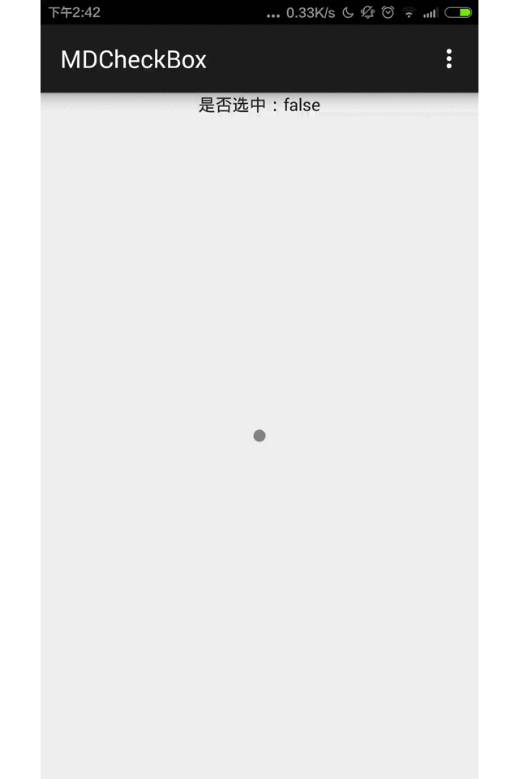

# MDCheckBox
这是一个MD风格的CheckBox
###效果


###用法

```java
<com.zsl.mdcheckbox.MDCheckBox
        android:id="@+id/main_mdcb_checkbox"
        android:layout_width="40dp"
        android:layout_height="40dp" />
```
###监听事件
```java
MDCheckBox mdcb= (MDCheckBox) findViewById(R.id.main_mdcb_checkbox);
mdcb.setOnCheckedChangeListener(new MDCheckBox.OnCheckedChangeListener() {
    @Override
    public void onCheckedChanged(View buttonView, boolean isChecked) {
        tv_name.setText("是否选中："+isChecked);
    }
});
```

